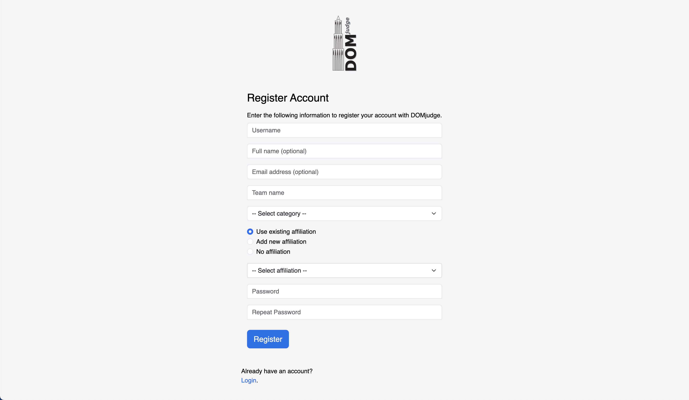
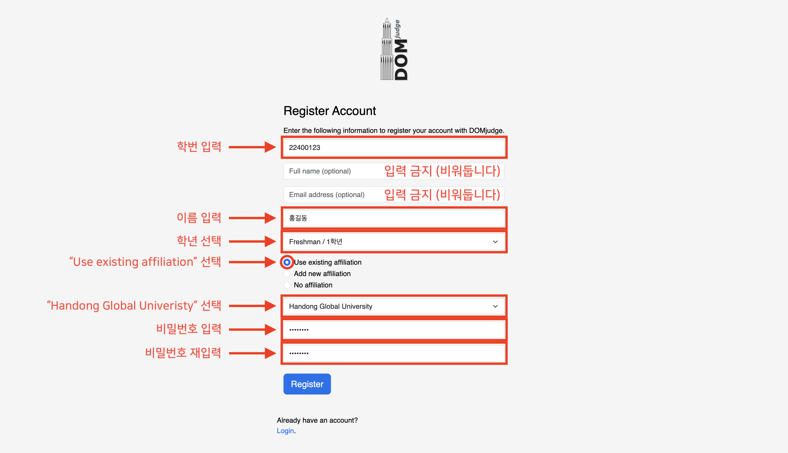
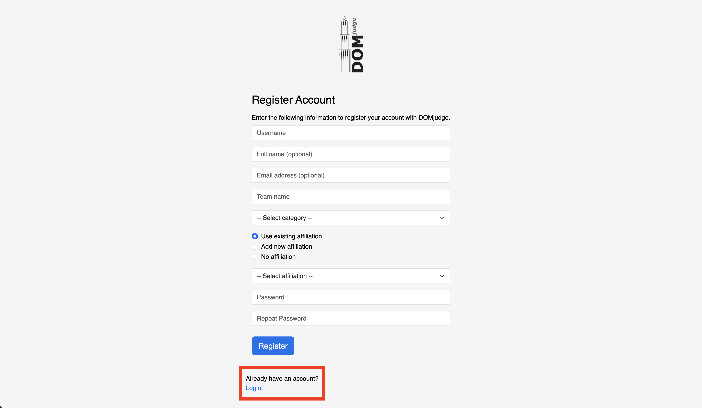
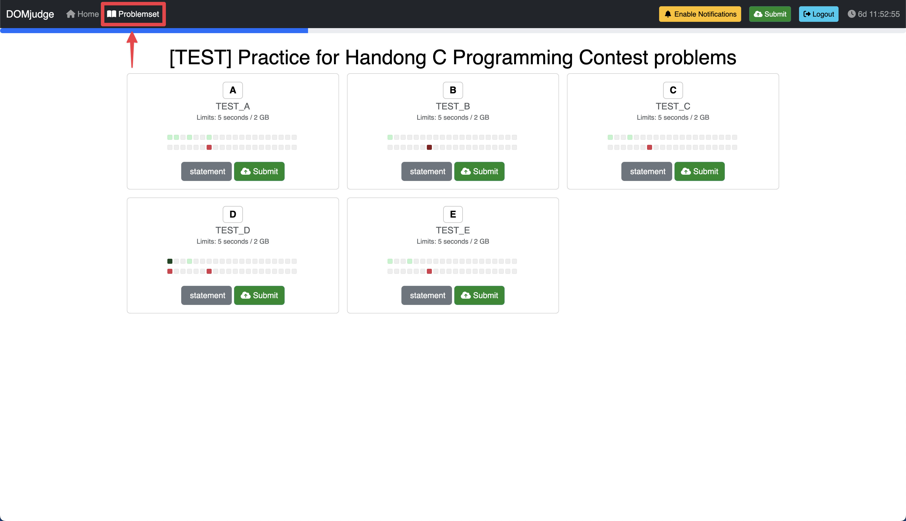
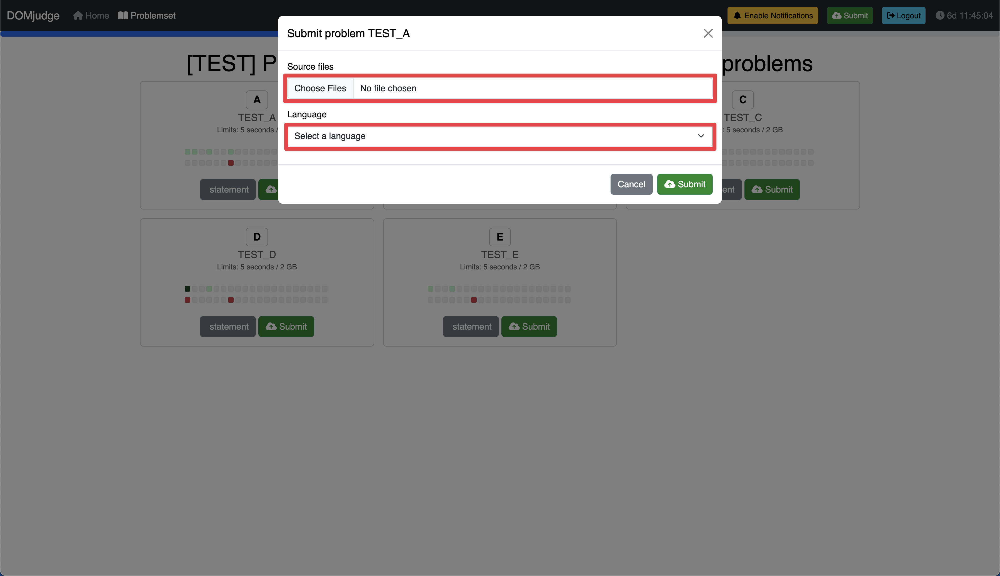
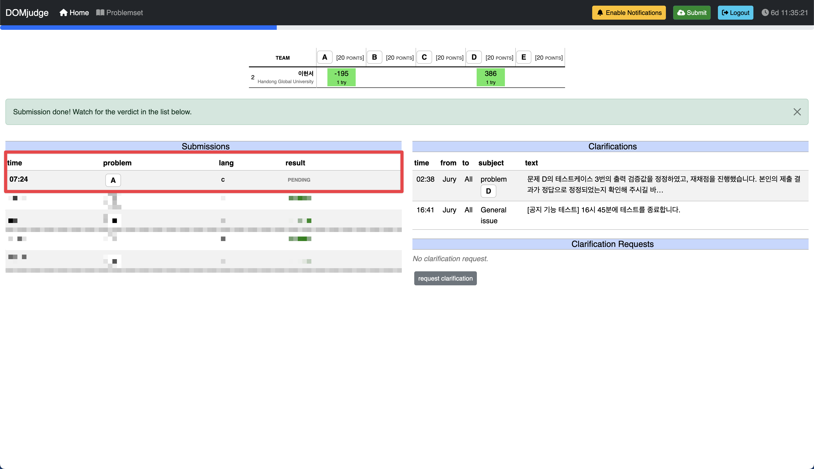

# 2025 Handong C Boot Camp

마지막 업데이트: 2025. 02. 17.

이 코드 저장소는 2025 한동대학교 C Boot Camp에 대한 정보를 담고 있습니다. 캠프 참가자 분들 께서는 반드시 아래 내용을 숙지하시고, 캠프에 임해주시기 바랍니다.

---

## 목차
- [캠프 웹사이트 가이드](#캠프-웹사이트-가이드)
    - [계정 생성](#계정-생성)
    - [로그인](#로그인)
    - [문제 풀기](#문제-풀기)
    - [질문](#질문)
- 부록
    - [컴파일러 정보](#컴파일러-정보)

---

## 캠프 웹사이트 가이드

### 계정 생성

> [!IMPORTANT]
> 반드시 아래 가이드를 끝까지 숙지하시고, 계정을 생성해주세요. 

1. 캠프 웹사이트 접속

    [캠프 웹사이트 (https://contest.walab.info/)](https://contest.walab.info/)에 접속합니다.

2. 계정 생성

> [!NOTE]
> 2024-2학기에 코딩스튜디오를 수강하였거나, 한동 C 컨테스트에 참가한 적이 있는 경우, 이미 계정이 생성되어 있습니다. 계정을 추가로 생성하지 말고 기존 계정을 사용해 주시기 바랍니다.

> [!WARNING]
> 만약 계정을 잘못 생성한 경우, 혹은 생성한 비밀번호를 잊어버린 경우, 계정을 새로 생성하지 마시고, [hslee@handong.ac.kr](mailto:hslee@handong.ac.kr) (TA 이현서) 에게 문의해주세요.
    
    캠프 웹사이트에 접속하면 다음과 같은 화면이 나타납니다.
    

    웹사이트에 처음 방문한 경우, 계정을 생성해야 합니다. 아래 필드별 설명을 읽고 계정을 생성해주세요.

    - `Username`: 본인의 **학번**을 입력합니다 (e.g. 22100600)
    - `Full name (optional)`: **입력하지 않습니다** (비워둡니다)
    - `Email address (optional)`: **입력하지 않습니다** (비워둡니다)
    - `Team name`: 본인의 **이름**을 입력합니다 (e.g. 이현서)
    - `--Select category--`: 클릭 후 드롭다운 메뉴에서 본인의 **학년**을 선택합니다 (e.g. Senior / 4학년)
    - `라디오 버튼`: `Use existing affiliation`을 선택합니다.
    - `--Select affiliation--`: 클릭 후 드롭다운 메뉴에서 `Handong Global University`를 선택합니다.
    - `Password`: 원하는 **비밀번호**를 입력합니다.
    - `Repeat Password`: 위에서 입력한 **비밀번호**를 **다시** 입력합니다.

    모든 필드를 올바르게 입력한 예시는 다음과 같습니다.
    

    모든 필드를 올바르게 입력한 후, `Register` 버튼을 클릭합니다.

### 로그인



회원가입을 완료했다면 자동으로 로그인이 됩니다. 만약 브라우저를 닫았다가 다시 접속했을 때 로그인이 되어있지 않다면, 회원가입을 다시 진행하지 않고, "Register" 버튼 하단의 "Login" 버튼을 클릭하여 로그인을 진행해주세요.

### 문제 풀기

캠프 플랫폼에서는 다음과 같은 단계로 문제를 풀고 제출하게 됩니다.

1. 문제 설명 확인
2. 문제 풀기
3. 제출
4. 결과 확인

단계별로 과정을 설명하겠습니다.

#### 1. 문제 설명 확인

캠프 플랫폼에 로그인 하고, 상단 `Problemset` 탭을 클릭하면 다음과 같은 화면이 나타납니다.



각 문제별로, `statement` 버튼과 `Submit` 버튼이 존재합니다.

- `statement` 버튼 : 문제 설명을 확인할 수 있는 버튼입니다.
- `Submit` 버튼 : 문제를 제출할 수 있는 버튼입니다.

문제를 풀기 전, `statement` 버튼을 클릭하여 문제 설명을 확인해주세요.

#### 2. 문제 풀기

문제 설명을 확인했다면, 문제 설명에 맞게 코드를 작성해주세요.

캠프 플랫폼에는 코드를 작성할 수 있는 온라인 에디터가 없습니다. 따라서, 모든 코드는 로컬에서 (e.g. Visual Studio Code, Sublime Text, etc.) 작성하거나, 다음 온라인 에디터를 사용하여 작성한 후 다운로드 받아 주세요.

- [OnlineGDB](https://www.onlinegdb.com/)
- [Repl.it](https://repl.it/)

#### 3. 제출

문제를 풀었다면, 캠프 플랫폼에 로그인한 상태에서, 제출할 문제의 `Submit` 버튼을 클릭합니다.

`Submit` 버튼을 클릭하면, 다음과 같은 화면이 나타납니다.



- `Source files`: 문제를 푼 코드 파일을 업로드합니다.
- `Language`: 코드 파일의 언어를 선택합니다. (C 언어)

모든 정보를 올바르게 입력한 후, `Submit` 버튼을 클릭합니다.

#### 4. 결과 확인

코드를 제출하면, 플랫폼에서 코드를 컴파일하고, 테스트를 진행합니다.



결과는 다음 중 하나로 나타납니다.

- `PENDING` : 제출한 코드가 검사 대기 중인 상태입니다.
- `CORRECT` : 제출한 코드가 정답입니다.
- `WRONG-ANSWER` : 제출한 코드의 결과가 정답과 다릅니다.
- `RUN-ERROR` : 제출한 코드가 실행 중 오류가 발생했습니다.
- `COMPILER-ERROR` : 제출한 코드가 컴파일 중 오류가 발생했습니다.
- `TIMELIMIT` : 제출한 코드가 실행 시간 제한을 초과했습니다.
- `NO-OUTPUT` : 제출한 코드가 출력을 하지 않았습니다.
- `OUTPUT-LIMIT` : 제출한 코드가 출력 길이 제한을 초과했습니다.
- `TOO-LATE` : 캠프 시간 내에 코드를 제출하지 않았습니다.

> [!NOTE]
> 최신 결과를 확인하기 위해 페이지를 새로고침하세요.

### 질문

캠프에 참가하면서 캠프 전반에 대한 질문이나, 문제에 대한 질문이 있을 경우, `Classum` 을 통해 캠프 수강생과 TA 및 교수님에게 질문을 남길 수 있습니다.

Classum 초대 링크: [Classum](https://www.classum.com/R3UR23Q7B)

---

## 부록

### 컴파일러 정보

- 컴파일러 :
    ```txt
    gcc version 12.2.0 (Debian 12.2.0-14)
    ```

- 컴파일 명령어 :
    ```bash
    gcc -x c -Wall -O2 -static -pipe -o run run.c -lm
    ```