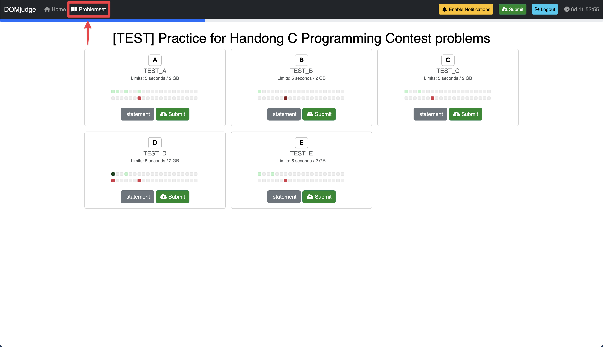
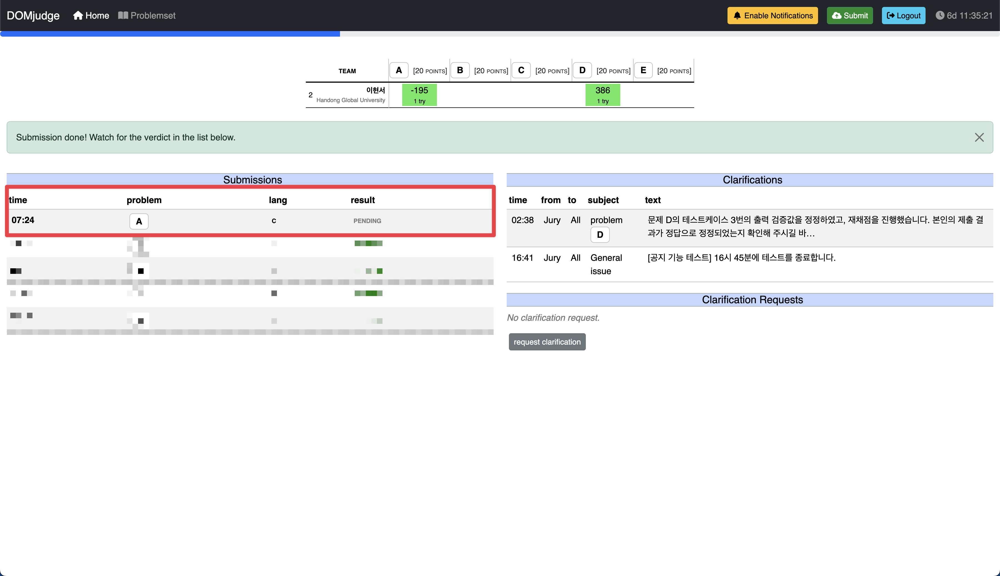
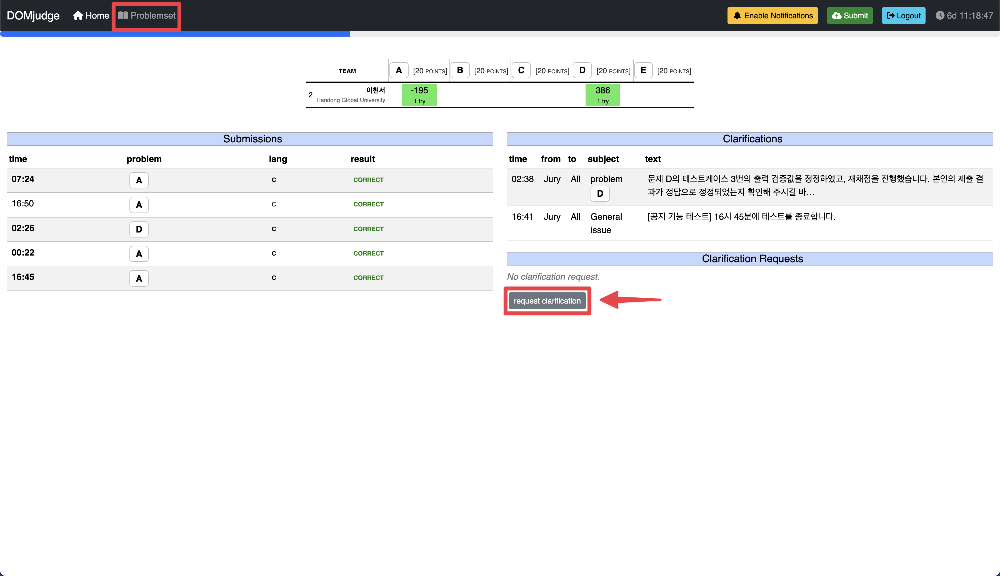

# 2024 Handong C Contest

> [!NOTE]
> This document is also available in English. Please refer to the [README_EN.md](README_EN.md) file.

마지막 업데이트: 2024. 12. 05.

이 코드 저장소는 2024 한동대학교 C 프로그래밍 경진대회에 대한 정보를 담고 있습니다. 대회 참가자 분들 께서는 반드시 아래 내용을 숙지하시고, 대회에 임해주시기 바랍니다.

---

## 목차
- [대회 개요](#대회-개요)
- [대회 규칙](#대회-규칙)
- [대회 웹사이트 가이드](#대회-웹사이트-가이드)
    - [계정 생성](#계정-생성)
    - [로그인](#로그인)
    - [문제 풀기](#문제-풀기)
    - [질문](#질문)
- 부록
    - [컴파일러 정보](#컴파일러-정보)

---

## 대회 개요

> [!IMPORTANT]
> [계정 생성](#계정-생성) 가이드를 확인하기 전까지 임의로 계정을 생성하지 마세요. 정해진 규칙에 따라 계정을 생성하지 않은 경우, 대회 참가가 불가능할 수 있습니다.

- 대회명 : 2024 한동대학교 C 프로그래밍 경진대회
- 일시 : 2024년 12월 6일 (금) 20:00 ~ 22:00
    - 테스트 대회
        - 대회 플랫폼이 익숙하지 않은 참가자 분들을 위해 미리 연습 문제를 풀어보고 제출해볼 수 있는 테스트 대회를 진행하고 있습니다.
- 참가 대상 : 한동대학교 GLS 학부생 및 전산전자공학부 비전공자
- 대회 진행 방식 : [온라인 (https://contest.walab.info/)](https://contest.walab.info/)
- 문제 개수 : 9문제 (A ~ I)

---

## 대회 규칙

> [!CAUTION]
> 대회 규칙을 준수하지 않는 경우 패널티가 있을 수 있으며, 이에 따른 모든 책임은 참가자에게 있습니다.

1. 모든 문제는 C 언어로만 풀어야 합니다.

1. 1학년의 C프로그래밍 능력을 평가하는 컨테스트입니다. 수업내용의 수준을 훨씬 뛰어넘는 코드는 패널티가 부여될 수 있습니다.

1. 올바르게 등록하지 않은 참가자는 대회 참가자로 인정되지 않습니다.
    - [계정 생성](#계정-생성) 가이드를 참고하여 계정을 생성해주세요.

1. 대회 기간 중에는 원하는 만큼 문제를 풀고 제출할 수 있습니다.
    - 같은 문제를 여러번 제출할 경우, 가장 먼저 정답으로 인정된 제출물만 점수로 인정됩니다.

1. 대회 기간이 종료된 경우, 코드를 제출할 수 없습니다.

1. 모든 코드 제출물의 파일명은 다음과 같은 규칙을 따라야 합니다.
    - `문제코드_학번.c` (e.g. `A_22400123.c`)

1. 모든 코드 제출물 최상단에 다음과 같은 아너코드 선언 주석을 포함해야 합니다.
   
   ```
   /*
   * [Full Name] : <이름>
   * [Student ID] : <학번>
   * [Honor Code Pledge] : 나 <이름>은(는) 하나님과 사람 앞에서 정직하고 성실하게 코딩 테스트를 수행하겠습니다.
   */
   ```

   e.g.
   
   ```
    /*
    * [Full Name] : 홍길동
    * [Student ID] : 22400123
    * [Honor Code Pledge] : 나 홍길동은(는) 하나님과 사람 앞에서 정직하고 성실하게 코딩 테스트를 수행하겠습니다.
    */
    ```

1. 문제 해결을 위해 허용되는 행위와 허용되지 않는 행위는 다음과 같습니다.
    - 허용되는 행위
        - 아래 명시된 웹사이트 참고
            - 이 Github 저장소
            - [모두의 코드](https://modoocode.com/)
            - [C Documentation](https://devdocs.io/c/)
    - 허용되지 않는 행위
        - 명시된 웹사이트 이외 타 사이트 참고
        - 모든 종류의 생성형 AI, LLM 및 그에 준하는 소프트웨어 사용 (e.g. ChatGPT, Cursor, Github Copilot, etc.)
        - 타인과의 소통, 협업
        - 타인의 계정을 이용하여 대회에 참가하거나 대리 참가하는 행위
        - 하드코딩 (e.g. 문제의 정답을 코드에 직접 입력)
        - 이 외 스스로 문제를 해결하지 않거나 대회의 공정성을 해치는 모든 행위

---

## 대회 웹사이트 가이드

### 계정 생성

> [!IMPORTANT]
> 반드시 아래 가이드를 끝까지 숙지하시고, 계정을 생성해주세요. 

1. 대회 웹사이트 접속

    [대회 웹사이트 (https://contest.walab.info/)](https://contest.walab.info/)에 접속합니다.

2. 계정 생성
    
    대회 웹사이트에 접속하면 다음과 같은 화면이 나타납니다.
    

    웹사이트에 처음 방문한 경우, 계정을 생성해야 합니다. 아래 필드별 설명을 읽고 계정을 생성해주세요.

    - `Username`: 본인의 **학번**을 입력합니다 (e.g. 22100600)
    - `Full name (optional)`: **입력하지 않습니다** (비워둡니다)
    - `Email address (optional)`: **입력하지 않습니다** (비워둡니다)
    - `Team name`: 본인의 **이름**을 입력합니다 (e.g. 이현서)
    - `--Select category--`: 클릭 후 드롭다운 메뉴에서 본인의 **학년**을 선택합니다 (e.g. Senior / 4학년)
    - `라디오 버튼`: `Use existing affiliation`을 선택합니다.
    - `--Select affiliation--`: 클릭 후 드롭다운 메뉴에서 `Handong Global University`를 선택합니다.
    - `Password`: 원하는 **비밀번호**를 입력합니다.
    - `Repeat Password`: 위에서 입력한 **비밀번호**를 **다시** 입력합니다.

    모든 필드를 올바르게 입력한 예시는 다음과 같습니다.
    

    모든 필드를 올바르게 입력한 후, `Register` 버튼을 클릭합니다.

    > 만약 계정을 잘못 생성한 경우, 혹은 생성한 비밀번호를 잊어버린 경우, 계정을 새로 생성하지 마시고, [hslee@handong.ac.kr](mailto:hslee@handong.ac.kr) (TA 이현서) 에게 문의해주세요.

### 로그인


회원가입을 완료했다면 자동으로 로그인이 됩니다. 만약 브라우저를 닫았다가 다시 접속했을 때 로그인이 되어있지 않다면, 회원가입을 다시 진행하지 않고, "Register" 버튼 하단의 "Login" 버튼을 클릭하여 로그인을 진행해주세요.

### 문제 풀기

대회 플랫폼에서는 다음과 같은 단계로 문제를 풀고 제출하게 됩니다.

1. 문제 설명 확인
2. 문제 풀기
3. 제출
4. 결과 확인

단계별로 과정을 설명하겠습니다.

#### 1. 문제 설명 확인

대회 플랫폼에 로그인 하고, 상단 `Problemset` 탭을 클릭하면 다음과 같은 화면이 나타납니다.



각 문제별로, `statement` 버튼과 `Submit` 버튼이 존재합니다.

- `statement` 버튼 : 문제 설명을 확인할 수 있는 버튼입니다.
- `Submit` 버튼 : 문제를 제출할 수 있는 버튼입니다.

문제를 풀기 전, `statement` 버튼을 클릭하여 문제 설명을 확인해주세요.

#### 2. 문제 풀기

> [!IMPORTANT]
> 대회 규칙을 함께 확인해 주세요.

문제 설명을 확인했다면, 문제 설명에 맞게 코드를 작성해주세요.

대회 플랫폼에는 코드를 작성할 수 있는 온라인 에디터가 없습니다. 따라서, 모든 코드는 로컬에서 (e.g. Visual Studio Code, Sublime Text, etc.) 작성하거나, 다음 온라인 에디터를 사용하여 작성한 후 다운로드 받아 주세요.

- [OnlineGDB](https://www.onlinegdb.com/)
- [Repl.it](https://repl.it/)

#### 3. 제출

문제를 풀었다면, 대회 플랫폼에 로그인한 상태에서, 제출할 문제의 `Submit` 버튼을 클릭합니다.

`Submit` 버튼을 클릭하면, 다음과 같은 화면이 나타납니다.


- `Source files`: 문제를 푼 코드 파일을 업로드합니다.
- `Language`: 코드 파일의 언어를 선택합니다. (C 언어)

모든 정보를 올바르게 입력한 후, `Submit` 버튼을 클릭합니다.

#### 4. 결과 확인

코드를 제출하면, 플랫폼에서 코드를 컴파일하고, 테스트를 진행합니다.



결과는 다음 중 하나로 나타납니다.

- `PENDING` : 제출한 코드가 검사 대기 중인 상태입니다.
- `CORRECT` : 제출한 코드가 정답입니다.
- `WRONG-ANSWER` : 제출한 코드의 결과가 정답과 다릅니다.
- `RUN-ERROR` : 제출한 코드가 실행 중 오류가 발생했습니다.
- `COMPILER-ERROR` : 제출한 코드가 컴파일 중 오류가 발생했습니다.
- `TIMELIMIT` : 제출한 코드가 실행 시간 제한을 초과했습니다.
- `NO-OUTPUT` : 제출한 코드가 출력을 하지 않았습니다.
- `OUTPUT-LIMIT` : 제출한 코드가 출력 길이 제한을 초과했습니다.
- `TOO-LATE` : 대회 시간 내에 코드를 제출하지 않았습니다.

> [!NOTE]
> 최신 결과를 확인하기 위해 페이지를 새로고침하세요.

### 질문

> [!IMPORTANT]
> 문제에 대한 직접적인 질문이나 해설은 답변하지 않을 수 있습니다.

대회에 참가하면서 대회 전반에 대한 질문이나, 문제에 대한 질문이 있을 경우, `Clarification` 기능을 사용하여 질문을 남길 수 있습니다.

`Clarification`은 대회 관리자가 참가자의 질문을 확인하고 답변할 수 있는 기능입니다.

질문을 남기려면, 대회 플랫폼에 로그인한 상태에서, 상단 `Home` 탭을 클릭하고, `request clarification` 버튼을 클릭합니다.



`request clarification` 버튼을 클릭하면, 다음과 같은 화면이 나타납니다.


다음 양식에 맞춰 질문을 작성하고, `Send` 버튼을 클릭합니다.

- `Recipient`: Jury (고정값)
- `Subject`: 질문의 주제
    - `General issue`: 대회 전반에 대한 질문
    - `Technical issue`: 대회 플랫폼에 대한 질문
    - `문제 번호`: 특정 문제에 대한 질문
- `Message`: 질문 내용

---

## 부록

### 컴파일러 정보

- 컴파일러 :
    ```txt
    gcc version 12.2.0 (Debian 12.2.0-14)
    ```

- 컴파일 명령어 :
    ```bash
    gcc -x c -Wall -O2 -static -pipe -o run run.c -lm
    ```