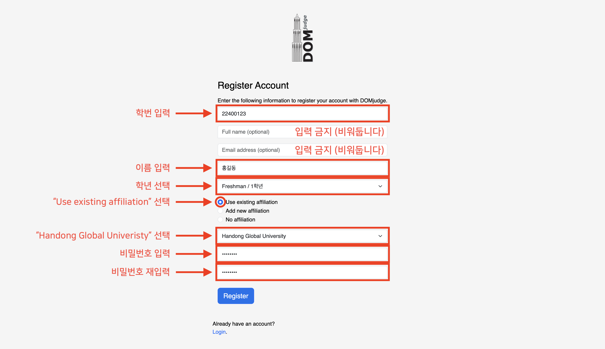
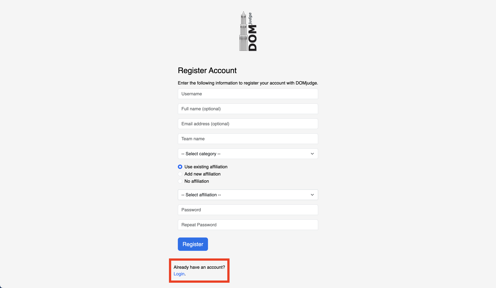

# 2024 Handong C Contest

> [!NOTE]
> This document is also available in English. Please refer to the [README_EN.md](README_EN.md) file.

마지막 업데이트: 2024. 11. 28.

이 코드 저장소는 2024 한동대학교 C 프로그래밍 경진대회에 대한 정보를 담고 있습니다. 대회 참가자 분들 께서는 반드시 아래 내용을 숙지하시고, 대회에 임해주시기 바랍니다.

## 목차
- [대회 개요](#대회-개요)
- [대회 규칙](#대회-규칙)
- [대회 웹사이트 가이드](#대회-웹사이트-가이드)
    - [계정 생성](#계정-생성)
    - [로그인](#로그인)
- 부록
    - [컴파일러 정보](#컴파일러-정보)

## 대회 개요

> [!IMPORTANT]
> [계정 생성](#계정-생성) 가이드를 확인하기 전까지 임의로 계정을 생성하지 마세요. 정해진 규칙에 따라 계정을 생성하지 않은 경우, 대회 참가가 불가능할 수 있습니다.

- 대회명 : 2024 한동대학교 C 프로그래밍 경진대회
- 일시 : 2024년 12월 6일 (금) 20:00 ~
    - 테스트 대회
        - 대회 플랫폼이 익숙하지 않은 참가자 분들을 위해 미리 연습 문제를 풀어보고 제출해볼 수 있는 테스트 대회를 진행하고 있습니다.
- 참가 대상 : 한동대학교 GLS 학부생 및 전산전자공학부 비전공자
- 대회 진행 방식 : [온라인 (https://contest.walab.info/)](https://contest.walab.info/)

## 대회 웹사이트 가이드

### 계정 생성

> [!IMPORTANT]
> 반드시 아래 가이드를 끝까지 숙지하시고, 계정을 생성해주세요. 

1. 대회 웹사이트 접속

    [대회 웹사이트 (https://contest.walab.info/)](https://contest.walab.info/)에 접속합니다.

2. 계정 생성
    
    대회 웹사이트에 접속하면 다음과 같은 화면이 나타납니다.
    

    웹사이트에 처음 방문한 경우, 계정을 생성해야 합니다. 아래 필드별 설명을 읽고 계정을 생성해주세요.

    - `Username`: 본인의 **학번**을 입력합니다 (e.g. 22100600)
    - `Full name (optional)`: **입력하지 않습니다** (비워둡니다)
    - `Email address (optional)`: **입력하지 않습니다** (비워둡니다)
    - `Team name`: 본인의 **이름**을 입력합니다 (e.g. 이현서)
    - `--Select category--`: 클릭 후 드롭다운 메뉴에서 본인의 **학년**을 선택합니다 (e.g. Senior / 4학년)
    - `라디오 버튼`: `Use existing affiliation`을 선택합니다.
    - `--Select affiliation--`: 클릭 후 드롭다운 메뉴에서 `Handong Global University`를 선택합니다.
    - `Password`: 원하는 **비밀번호**를 입력합니다.
    - `Repeat Password`: 위에서 입력한 **비밀번호**를 **다시** 입력합니다.

    모든 필드를 올바르게 입력한 예시는 다음과 같습니다.
    

    모든 필드를 올바르게 입력한 후, `Register` 버튼을 클릭합니다.

    > 만약 계정을 잘못 생성한 경우, 혹은 생성한 비밀번호를 잊어버린 경우, 계정을 새로 생성하지 마시고, [hslee@handong.ac.kr](mailto:hslee@handong.ac.kr) (TA 이현서) 에게 문의해주세요.

### 로그인



회원가입을 완료했다면 자동으로 로그인이 됩니다. 만약 브라우저를 닫았다가 다시 접속했을 때 로그인이 되어있지 않다면, 회원가입을 다시 진행하지 않고, "Register" 버튼 하단의 "Login" 버튼을 클릭하여 로그인을 진행해주세요.

## 대회 규칙

> [!CAUTION]
> 대회 규칙을 준수하지 않는 경우 패널티가 있을 수 있으며, 이에 따른 모든 책임은 참가자에게 있습니다.

1. 모든 문제는 C 언어로만 풀어야 합니다.

2. 모든 코드 제출물의 파일명은 다음과 같은 규칙을 따라야 합니다.
    - `문제코드_학번.c` (e.g. `A_22400123.c`)

3. 모든 코드 제출물 최상단에 다음과 같은 주석을 포함해야 합니다.
   ```c
   /*
   * [Full Name] : <이름>
   * [Student ID] : <학번>
   * [Honor Code Pledge] : 나 <이름>은(는) 하나님과 사람 앞에서 정직하고 성실하게 코딩 테스트를 수행하겠습니다.
   */
   ```

   e.g.
   ```c
    /*
    * [Full Name] : 홍길동
    * [Student ID] : 22400123
    * [Honor Code Pledge] : 나 홍길동은(는) 하나님과 사람 앞에서 정직하고 성실하게 코딩 테스트를 수행하겠습니다.
    */
    ```

4. 문제 해결을 위해 허용되는 행위와 허용되지 않는 행위는 다음과 같습니다.
    - 허용되는 행위
        - 아래 명시된 웹사이트 참고
            - 이 Github 저장소
            - [모두의 코드](https://modoocode.com/)
            - [C Documentation](https://devdocs.io/c/)
    - 허용되지 않는 행위
        - 명시된 웹사이트 이외 타 사이트 참고
        - 모든 종류의 생성형 AI, LLM 및 그에 준하는 소프트웨어 사용 (e.g. ChatGPT, Cursor, Github Copilot, etc.)
        - 타인과의 소통, 협업
        - 이 외 스스로 문제를 해결하지 않거나 대회의 공정성을 해치는 모든 행위

## 부록

### 컴파일러 정보

- 컴파일러 :
    ```txt
    gcc version 12.2.0 (Debian 12.2.0-14)
    ```

- 컴파일 명령어 :
    ```bash
    gcc -x c -Wall -O2 -static -pipe -o run run.c -lm
    ```