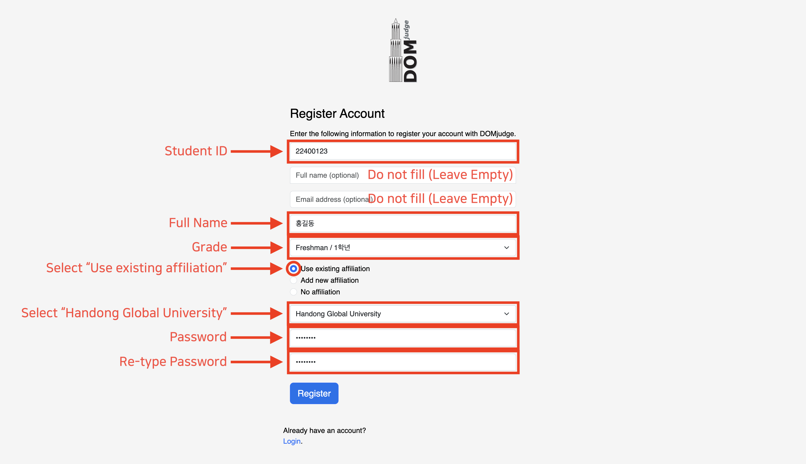

# 2024 Handong C Contest

> [!NOTE]
> 이 문서는 한국어로도 제공됩니다. [README.md](README.md) 파일을 참고하세요.

Last Updated: November 28, 2024.

This repository contains information about the 2024 Handong University C Programming Contest. All participants are required to review the details below carefully before taking part in the contest.

## Table of Contents
- [Contest Overview](#contest-overview)
- [Contest Rules](#contest-rules)
- [Contest Website Guide](#contest-website-guide)
    - [Account Creation](#account-creation)
    - [Login](#login)
- Appendix
    - [Compiler Information](#compiler-information)

## Contest Overview

> [!IMPORTANT]
> Do not create an account until you review the [Account Creation](#account-creation) guide. Failure to follow the specified process may result in disqualification.

- Contest Name: 2024 Handong University C Programming Contest
- Date: Friday, December 6, 2024, at 8:00 PM
    - Practice Contest: A practice session is available for participants to solve sample problems and familiarize themselves with the contest platform.
- Participants: GLS undergraduate students and non-CS major students in the School of Computer Science and Electrical Engineering at Handong University
- Format: [Online (https://contest.walab.info/)](https://contest.walab.info/)

## Contest Website Guide

### Account Creation

> [!IMPORTANT]
> Please thoroughly review the guide below before creating your account.

1. Access the Contest Website

    Visit the [contest website (https://contest.walab.info/)](https://contest.walab.info/).

2. Create an Account

    Upon accessing the website, you will see the following screen:
    

    If this is your first visit, you need to create an account. Follow the instructions for each field:

    - `Username`: Enter your **student ID** (e.g., 22100600)
    - `Full name (optional)`: **Leave blank**
    - `Email address (optional)`: **Leave blank**
    - `Team name`: Enter your **full name** (e.g., Hyunseo Lee)
    - `--Select category--`: Select your **year of study** from the dropdown menu (e.g., Senior / 4th Year)
    - Radio Button: Select `Use existing affiliation`.
    - `--Select affiliation--`: Choose `Handong Global University` from the dropdown menu.
    - `Password`: Enter a **password** of your choice.
    - `Repeat Password`: Re-enter the **password** to confirm.

    An example of correctly filled fields is shown below:
    

    After completing all fields, click the `Register` button.

    > If you make an error during registration or forget your password, do not create a new account. Instead, contact [hslee@handong.ac.kr](mailto:hslee@handong.ac.kr) (TA Hyunseo Lee).

### Login


After registration, you will be automatically logged in. If you close the browser and revisit the website later, do not register again. Click the "Login" button below the "Register" button to log in.

## Contest Rules

> [!CAUTION]
> Violating the contest rules may result in penalties, and all responsibility lies with the participant.

1. All problems must be solved using the C programming language.

2. The filename for all submitted code must follow this format:
    - `ProblemCode_StudentID.c` (e.g., `A_22400123.c`)

3. Include the following comment block at the top of each submitted code file:
   ```c
   /*
   * [Full Name]: <Your Name>
   * [Student ID]: <Your Student ID>
   * [Honor Code Pledge]: I, <Your Name>, pledge before God and people to perform this coding test with honesty and integrity.
   */
   ```

   Example:
   ```c
   /*
   * [Full Name]: Hong Gildong
   * [Student ID]: 22400123
   * [Honor Code Pledge]: I, Hong Gildong, pledge before God and people to perform this coding test with honesty and integrity.
   */
   ```

4. Permitted and prohibited actions during the contest:
    - Permitted actions:
        - Referencing the following websites:
            - This GitHub repository
            - [Modoocode](https://modoocode.com/)
            - [C Documentation](https://devdocs.io/c/)
    - Prohibited actions:
        - Referencing websites other than those listed above
        - Using generative AI, LLMs, or similar software (e.g., ChatGPT, Cursor, GitHub Copilot, etc.)
        - Communicating or collaborating with others
        - Any actions that undermine the fairness or integrity of the contest

## Appendix

### Compiler Information

- Compiler:
    ```txt
    gcc version 12.2.0 (Debian 12.2.0-14)
    ```

- Compilation Command:
    ```bash
    gcc -x c -Wall -O2 -static -pipe -o run run.c -lm
    ```
