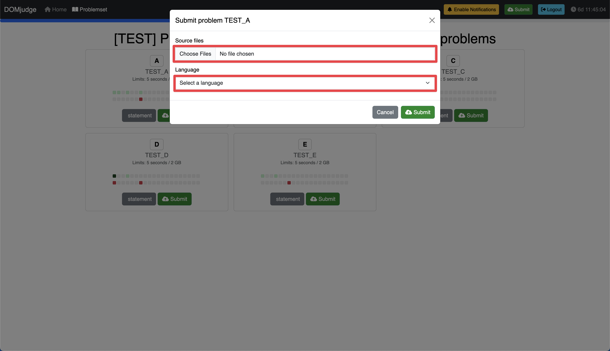

# 2024 Handong C Contest

> [!NOTE]
> 이 문서는 한국어로도 제공됩니다. [README.md](README.md) 파일을 참고하세요.

Last Updated: December 5, 2024.

This repository contains information about the 2024 Handong University C Programming Contest. All participants must review the details below carefully before taking part in the contest.

---

## Table of Contents
- [Contest Overview](#contest-overview)
- [Contest Rules](#contest-rules)
- [Contest Website Guide](#contest-website-guide)
    - [Account Creation](#account-creation)
    - [Login](#login)
    - [Solving Problems](#solving-problems)
    - [Inquiries](#inquiries)
- Appendix
    - [Compiler Information](#compiler-information)

---

## Contest Overview

> [!IMPORTANT]
> Do not create an account until you review the [Account Creation](#account-creation) guide. Failure to follow the specified process may result in disqualification.

- Contest Name: 2024 Handong University C Programming Contest
- Date: December 6, 2024 (Fri) 20:00 - 22:00
    - Practice Contest: A practice session is available to familiarize participants with the contest platform.
- Participants: GLS undergraduate students and non-CSEE major students
- Format: [Online (https://contest.walab.info/)](https://contest.walab.info/)
- Number of Problems: 10 (A ~ J)

---

## Contest Rules

> [!CAUTION]
> Violating the contest rules may result in penalties, and all responsibility lies with the participant.

1. All problems must be solved using the C programming language.

1. This is a contest to evaluate the C programming skills of freshman students. Code that significantly exceeds the level of the course content may incur penalties.

1. Participants who do not register properly will not be recognized as official contestants.
    - Refer to the [Account Creation](#account-creation) guide to create your account.

1. During the contest, you may solve and submit problems as many times as you wish.
    - If the same problem is submitted multiple times, only the first correct submission will be scored.

1. No submissions will be accepted after the contest ends.

1. All submitted code files must adhere to the following naming convention:
    - `ProblemCode_StudentID.c` (e.g., `A_22400123.c`)

1. All submitted code must include the following honor code declaration as a comment at the top:
   ```c
   /*
   * [Full Name]: <Your Name>
   * [Student ID]: <Your Student ID>
   * [Honor Code Pledge]: I, <Your Name>, pledge before God and people to perform this coding test with honesty and integrity.
   */
   ```

   Example:
   ```c
   /*
   * [Full Name]: Hong Gildong
   * [Student ID]: 22400123
   * [Honor Code Pledge]: I, Hong Gildong, pledge before God and people to perform this coding test with honesty and integrity.
   */
   ```

1. Permitted and prohibited actions during the contest:
    - Permitted actions:
        - Referencing the following websites:
            - This GitHub repository
            - [Modoocode](https://modoocode.com/)
            - [C Documentation](https://devdocs.io/c/)
    - Prohibited actions:
        - Referencing websites other than those listed above
        - Using generative AI, LLMs, or similar software (e.g., ChatGPT, Cursor, GitHub Copilot, etc.)
        - Communicating or collaborating with others
        - Using someone else’s account or proxy participating
        - Hardcoding (e.g., directly embedding answers in the code)
        - Any actions that undermine the fairness or integrity of the contest

---

## Contest Website Guide

### Account Creation

> [!IMPORTANT]
> Please thoroughly review the guide below before creating your account.

1. Access the Contest Website

    Visit the [contest website (https://contest.walab.info/)](https://contest.walab.info/).

2. Create an Account

    Upon accessing the website, you will see the following screen:
    

    If this is your first visit, you need to create an account. Follow the instructions for each field:

    - `Username`: Enter your **student ID** (e.g., 22100600)
    - `Full name (optional)`: **Leave blank**
    - `Email address (optional)`: **Leave blank**
    - `Team name`: Enter your **full name** (e.g., Hyunseo Lee)
    - `--Select category--`: Select your **year of study** from the dropdown menu (e.g., Senior / 4th Year)
    - Radio Button: Select `Use existing affiliation`.
    - `--Select affiliation--`: Choose `Handong Global University` from the dropdown menu.
    - `Password`: Enter a **password** of your choice.
    - `Repeat Password`: Re-enter the **password** to confirm.

    An example of correctly filled fields is shown below:
    

    After completing all fields, click the `Register` button.

    > If you make an error during registration or forget your password, do not create a new account. Instead, contact [hslee@handong.ac.kr](mailto:hslee@handong.ac.kr) (TA Hyunseo Lee).

### Login


After registration, you will be automatically logged in. If you close the browser and revisit the website later, do not register again. Click the "Login" button below the "Register" button to log in.

### Solving Problems

The contest platform involves the following steps for solving and submitting problems:

1. Reviewing the problem description
2. Solving the problem
3. Submitting the solution
4. Checking the results

#### 1. Reviewing the Problem Description

Log in to the contest platform and click the `Problemset` tab at the top to view the following screen:


Each problem has a `statement` button and a `Submit` button:

- `statement`: View the problem description.
- `Submit`: Submit your solution.

Before solving a problem, click the `statement` button to read the problem description.

#### 2. Solving the Problem

> [!IMPORTANT]
> Ensure compliance with the contest rules.

After reviewing the problem description, write your code to solve the problem.

The contest platform does not include an online code editor. Therefore, write your code locally (e.g., in Visual Studio Code, Sublime Text) or use online editors such as:

- [OnlineGDB](https://www.onlinegdb.com/)
- [Repl.it](https://repl.it/)

#### 3. Submitting the Solution

After solving the problem, log in to the contest platform and click the `Submit` button for the respective problem.

Clicking `Submit` will display the following screen:



- `Source files`: Upload your code file.
- `Language`: Select the programming language (C).

After entering the required information, click `Submit`.

#### 4. Checking the Results

Once submitted, the platform will compile and test your code.


Results will be displayed as one of the following:

- `PENDING`: Code is awaiting review.
- `CORRECT`: Code is correct.
- `WRONG-ANSWER`: Code produces incorrect results.
- `RUN-ERROR`: Code encountered an error during execution.
- `COMPILER-ERROR`: Code failed to compile.
- `TIMELIMIT`: Code exceeded the time limit.
- `NO-OUTPUT`: Code produced no output.
- `OUTPUT-LIMIT`: Code exceeded the output limit.
- `TOO-LATE`: Code was submitted after the contest ended.

> [!NOTE]
> Please refresh the page to view the latest results.

### Inquiries

> [!IMPORTANT]
> Questions regarding specific problems or solutions may not be answered directly.

During the contest, you can ask questions about the contest or specific problems using the `Clarification` feature.

To ask a question, log in to the contest platform, click the `Home` tab, and select the `request clarification` button.


Clicking `request clarification` displays the following form:


Complete the form and click `Send`:

- `Recipient`: Jury (fixed value)
- `Subject`: Topic of the question
    - `General issue`: General contest questions
    - `Technical issue`: Questions about the platform
    - `Problem number`: Questions about a specific problem
- `Message`: Question content

---

## Appendix

### Compiler Information

- Compiler:
    ```txt
    gcc version 12.2.0 (Debian 12.2.0-14)
    ```

- Compilation Command:
    ```bash
    gcc -x c -Wall -O2 -static -pipe -o run run.c -lm
    ```
